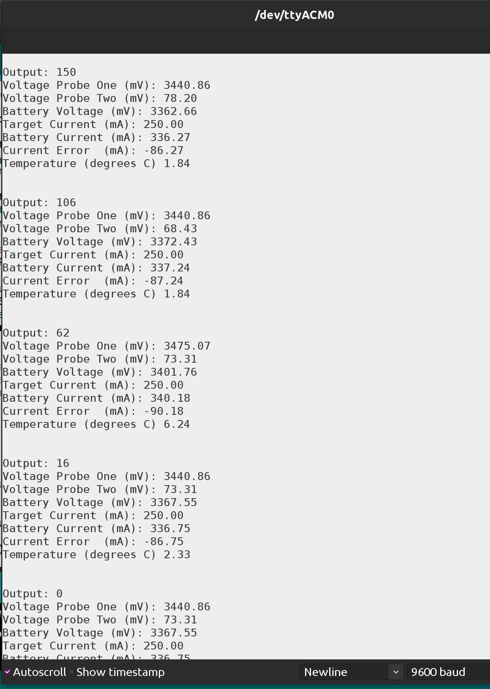
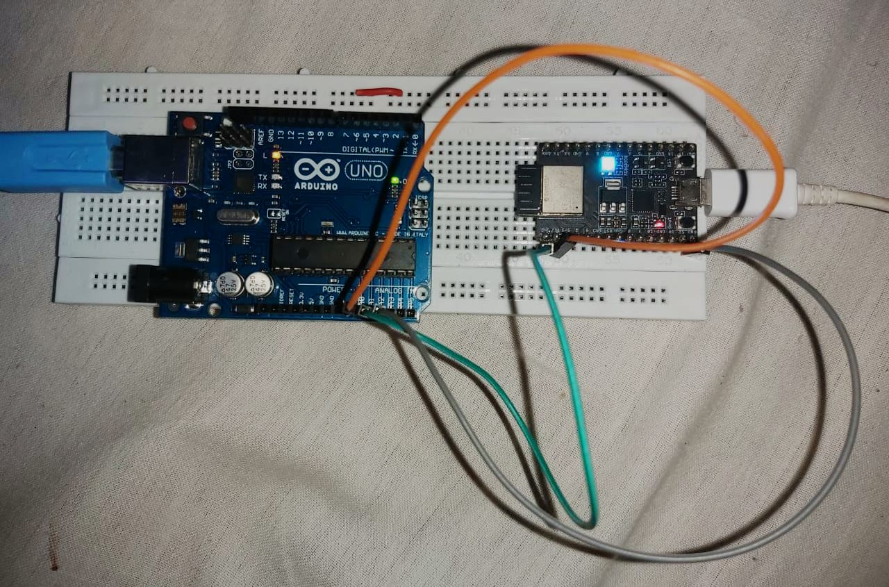

# Kalman_Implementation-Arduino-and-ESP32

## File Structure
```
.
├── 1_Basic_Implementation_Arduino           - Basic Implementation
│   └── 1_Basic_Implementation_Arduino.ino
├── 2_Kalman_Implementation                  - Kalman Implementation
│   └── 2_Kalman_Implementation.ino
├── assets                              
│   ├── output1.png
│   └── setup.jpeg
├── LICENSE
└── README.md
```
## To-Do List
- [x] Implemented basic Implementation using Arduino hardware 
- [x] Started with Kalman Implementation using Arduino  
- [ ] Complete Kalman Implementation using Arduino          (ETA 2-3 days)
- [ ] Make the code compatible for ESP32 using Arduino Ide  (ETA 5-6 days)
- [ ] Integrate and test using real time sensors
- [ ] Convert the whole code using ESP-IDF as well

## Output of Code
- This code is implemented on hard-coded and floating voltage pin values (standard values: 3.3v, 5v, GND) {dont have a proper variable voltage source} 
- Output of Serial Monitor 

## Arduino and ESP setup

